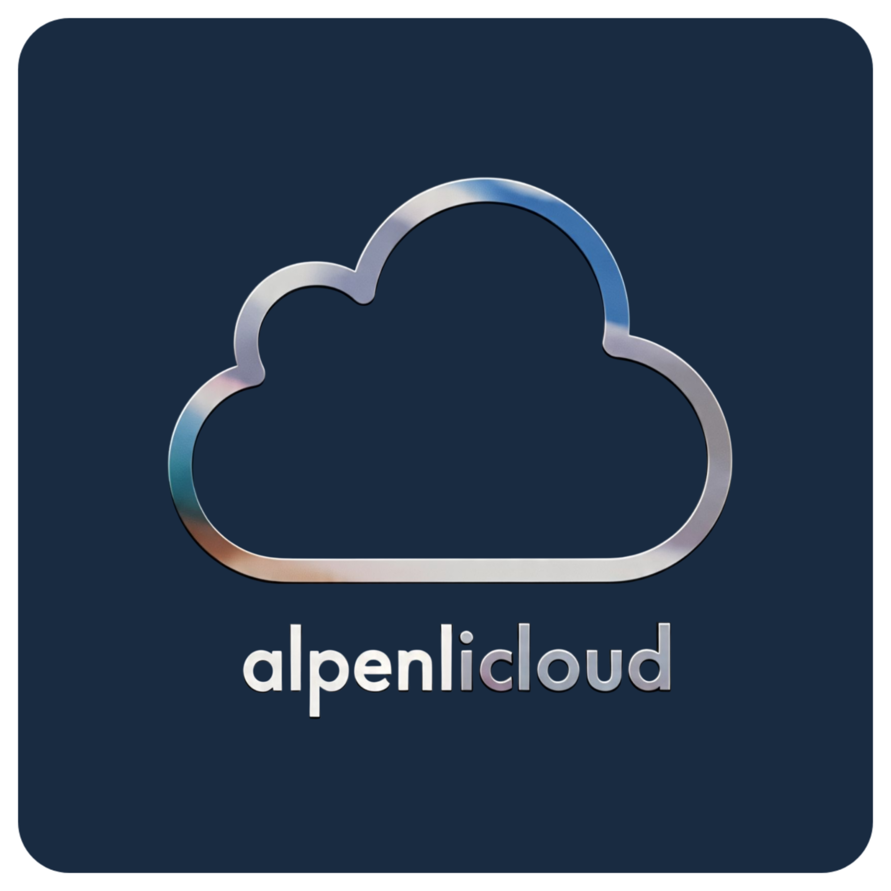

<!-- ============================================
     AlpenliCloud - File Manager GUI
     Data Structures & Algorithms - Final Project
     ============================================ -->

<table border="0" cellspacing="0" cellpadding="0">
    <tr>
        <td style="vertical-align:bottom; width:60px; padding-right:10px; border:none;">
            
        </td>
        <td style="vertical-align:middle; border:none;">
            <h1 style="margin:0;">AlpenliCloud</h1>
        </td>
    </tr>
</table>


Indonesian version: see [README-id.md](README-id.md).

## Overview

AlpenliCloud is a **File Manager** application with a **Graphical User Interface (GUI)** inspired by Windows Explorer. It implements **Abstract Data Types (ADT)** such as **non-binary tree**, **stack**, and **queue** to represent file system structure and behavior, with a modern interface built using raylib and raygui.

AlpenliCloud is now **cross-platform**: Windows, macOS, and Linux (with platform-specific raylib and dialog dependencies).

### Goal

This project was built for the **Data Structures & Algorithms** final project, focusing on applying data structures to file management. AlpenliCloud supports create, update, delete, recover, copy, move, and display operations through a friendly GUI. **Undo** and **redo** are supported via **stack**.

### Key Features

1. **Modern GUI**: Explorer-like layout with title bar, toolbar, navbar, sidebar, and body area
2. **File Manager Operations**:
    - Create file/folder with modal dialog
    - Rename file/folder (F2 shortcut)
    - Delete file/folder to trash with confirmation dialog
    - Copy (Ctrl+C), Cut (Ctrl+X), Paste (Ctrl+V)
    - Drag & drop support
3. **Navigation System**:
    - Sidebar tree structure with expand/collapse
    - Navbar with path navigation and search
    - Back navigation (Backspace/Alt+Left)
4. **Advanced Features**:
    - Progress bar for bulk operations (>10 items)
    - Undo/Redo system with visual feedback
    - Multi-selection with Ctrl+Click and Select All (Ctrl+A)
    - Full keyboard shortcuts
5. **Trash Management**:
    - Soft delete to trash directory
    - Recover files from trash
    - Duplicate name handling
6. **Window Management**:
    - Resizable window with drag borders
    - Maximize/minimize buttons
    - Custom title bar

### GUI Components

-   **TitleBar**: Window controls (minimize, maximize, close) and window dragging
-   **Navbar**: Path navigation, search box, and navigation buttons (back, undo, redo)
-   **Toolbar**: File operations (New, Copy, Cut, Paste, Delete, Rename)
-   **Sidebar**: Tree view for folder hierarchy navigation
-   **Body**: Main content area with file/folder listing in table format

## Data Structures Used

-   **Non-Binary Tree**: Represents directory and file system hierarchy
-   **Stack**: Powers undo and redo operations
-   **Queue**: Manages copied/cut items and paste operations
-   **LinkedList**: Manages selected items and trash items

## Tech Stack

-   **raylib**: Graphics library for rendering and input handling
-   **raygui**: Immediate mode GUI library for UI components
-   **C Language**: Core programming language
-   **Platform APIs**: System-specific utilities for file operations and dialogs

## How to Run

1. Ensure your system can compile C with raylib
2. Clone this repository:
    ```bash
    git clone https://github.com/riefproject/AlpenliCloud.git
    ```
3. Build and run:
    - Using build script:
        ```bash
        ./build.sh
        # Available parameters: clean, build, rebuild
        # Example: ./build.sh rebuild
        ```
    - Using debug script (with debug symbols):
        ```bash
        ./debug.sh
        ```
    - Using Makefile:
        ```bash
        make # optional parameter <clean | rebuild>
        ```

### Linux Notes

- Build uses `lib/raylib/lib/libraylib.so` if available.
- If not, build will try `pkg-config --cflags --libs raylib` and show a message to install raylib (`libraylib-dev`).
- File/folder dialogs use `zenity` or `kdialog`. Install one if missing.

## Usage

### Basic Navigation

-   **Double-click folder**: Enter directory
-   **Double-click file**: Open with default app
-   **Sidebar navigation**: Click folder in sidebar for quick navigation
-   **Path bar**: Type path manually to jump

### File Operations

-   **New File/Folder**: Click "New" in toolbar or Ctrl+N
-   **Copy**: Select item → Ctrl+C or Copy button
-   **Cut**: Select item → Ctrl+X or Cut button
-   **Paste**: Ctrl+V or Paste button
-   **Delete**: Select item → Delete key or Delete button
-   **Rename**: Select item → F2 or Rename button

### Selection

-   **Single select**: Click file/folder
-   **Multi-select**: Ctrl+Click to toggle selection
-   **Select all**: Ctrl+A or header checkbox
-   **Deselect all**: Click empty area or Ctrl+A again

### Keyboard Shortcuts

-   **Ctrl+C**: Copy selected items
-   **Ctrl+X**: Cut selected items
-   **Ctrl+V**: Paste items
-   **Ctrl+Z**: Undo last operation
-   **Ctrl+Y**: Redo operation
-   **F2**: Rename selected item
-   **F5/Ctrl+R**: Refresh view
-   **Delete**: Move to trash
-   **Backspace/Alt+Left**: Go back
-   **Ctrl+A**: Select/deselect all

## Project Structure

```
AlpenliCloud/
├── src/
│   ├── main.c                 # Application entry point
│   ├── file_manager.c         # Core file management logic
│   ├── utils.c               # Utility functions and shortcuts
│   ├── win_utils.c           # Platform-specific utilities
│   ├── gui/
│   │   ├── ctx.c             # GUI context management
│   │   ├── titlebar.c        # Window title bar component
│   │   ├── navbar.c          # Navigation bar component
│   │   ├── toolbar.c         # Toolbar component
│   │   ├── sidebar.c         # Sidebar tree component
│   │   ├── body.c            # Main content area
│   │   └── component.c       # Reusable UI components
│   └── data_structure/       # ADT implementations
├── include/                  # Header files
├── lib/raylib/              # raylib library
├── assets/                  # Icons and resources
├── build/                   # Build output
└── bin/                     # Executable output
```

## Contributing

Contributions are welcome. Please fork the repo and submit a pull request for improvements or new features.

## License

This project uses the [MIT](LICENSE) license.

## Contact

For questions or discussion, please use [GitHub Issues](https://github.com/riefproject/AlpenliCloud/issues).
